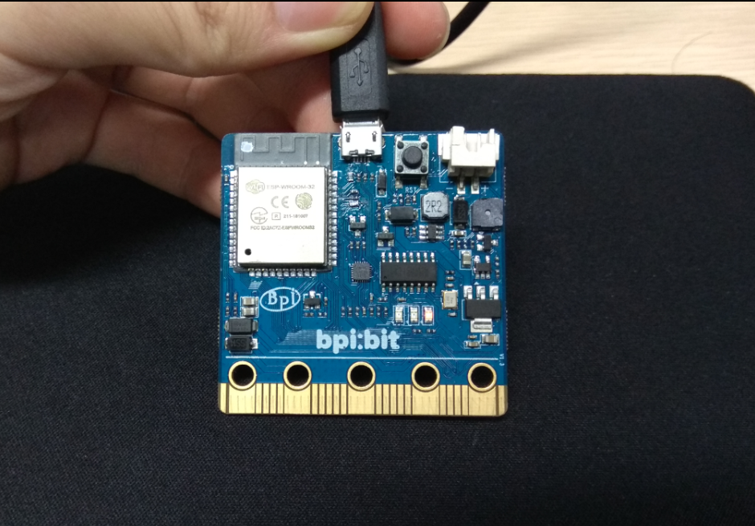
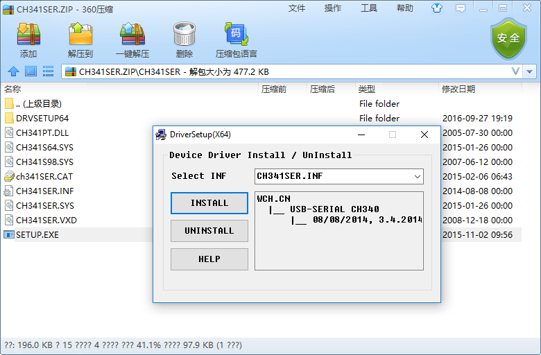

# &emsp;&emsp;&emsp;&emsp;&emsp;&emsp;&emsp;&emsp;&emsp; How do I install a driver?

[中文文档](driver.md)

## Connect the boards

This product adopts CH340 / CH341 serial driver chip, which can be installed automatically under Windows, Linux and other systems easily.

> [CH341SER related system driver](http://www.wch.cn/download/CH341SER_ZIP.html)

Connect the boards to your computer via the MicroUSB wire, as in the case of Windows 10.

## View the drivers

enter **device manager** to confirm whether Serial port driver is installed, enter as follows.

- (right click) this computer -> attribute -> **device manager**
- start menu -> (input) **device manager**
- control panel -> (search) **device manager**

you can see the device display **usb2.0-serial**, indicating that **has not been installed driver**.

## Install the driver

click here to access [Serial CH341](http://www.wch.cn/downloads/file/5.html) and according to the following instructions to install the driver

open the downloaded **CH341SER.ZIP** ZIP package, enter the **CH341SER** folder, open **SETUP.EXE**, you can see the following figure.

click  **INSTALL** and wait for a while to complete the installation.

## Confirm the serial port

check whether the board is connected successfully

you can see that the original **usb2.0-serial** is gone and replaced by **usb-serial CH340(COM3)**, which means that you have successfully installed the driver and got the name of the board Serial port as (**COM3**).

## Other systems

so far the board is connected successfully, Linux or Mac system requires you to baidu or Google.

