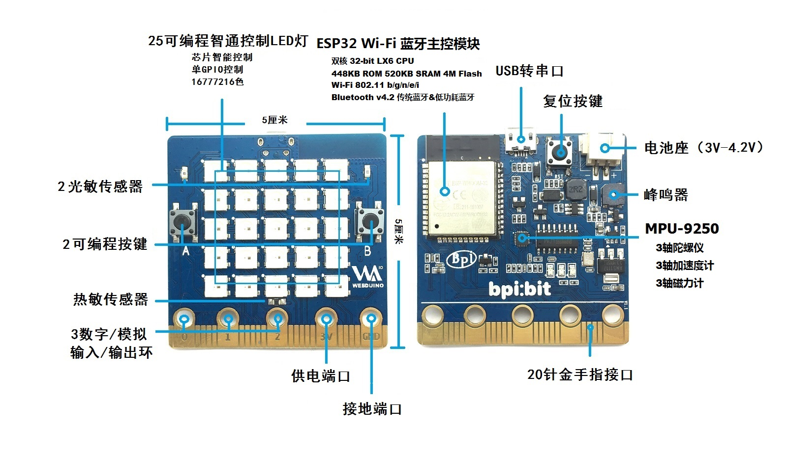
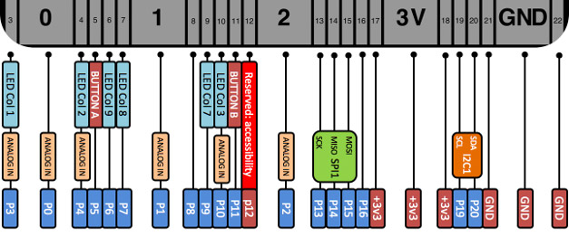
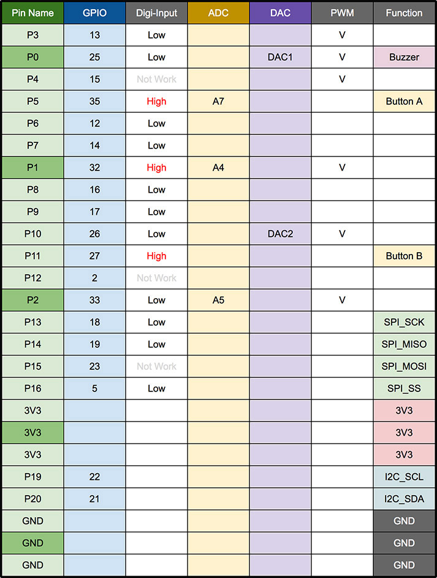
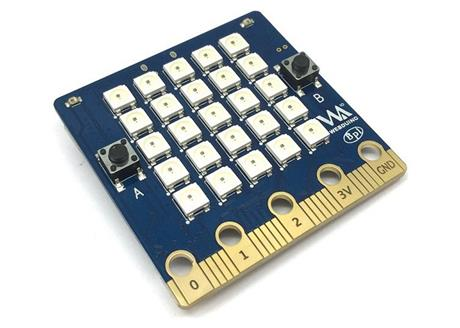
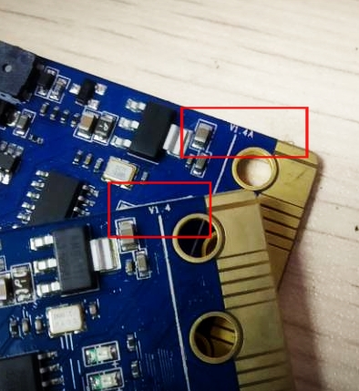
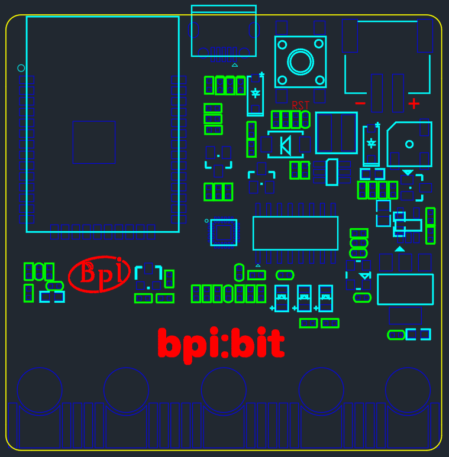
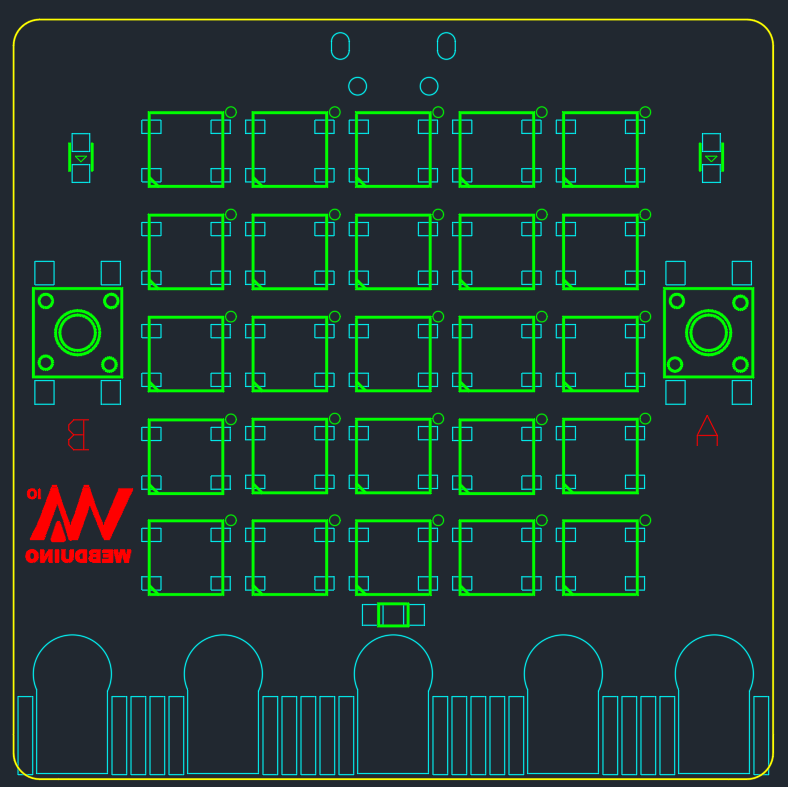

# &emsp;&emsp;&emsp;&emsp;&emsp;&emsp;&emsp;&emsp;&emsp;bpi:bit 开源硬件 📓

[English Docs](readme_en.md)

## 产品介绍

本产品采用 ESP-WROOM-32 （ESP32）模组作为核心进行设计，拥有 40nm 工艺、使用 Tensilica LX6 双核32位处理器，频率高达 240 MHz，带有 32 个 I/O 引脚，支持 2.4G Wi-Fi 、蓝牙 4.0 以上等多种通信方式，具备 448KB ROM 和 520 KB SRAM 的内存容量，处理速度达 600 DMIPS，搭配 40nm 工艺的超低功耗，是目前市面上最高效能、最稳定以及最通用的产品之一。

它又名 Webduino Bit ，是 Webduino 最新的开发板，除了原本的功能一应俱全 ( Wi-Fi 控制、多装置并联、协同工作... 等 )，更是内置了许多有趣的组件与传感器。

同时 bpi:bit 开源社区还将持续兼容 micro:bit 的大部分配件以及用法。

## 外观介绍

Webduino Bit 开发板长 5 公分宽 5 公分，重量约 10 ~ 12 公克，除了下方 20 Pin 的「金手指接口」，更内置一个 25 颗全彩 LED 灯的矩阵，两个光敏电阻、两个按钮开关、一个温度感应电阻、一个蜂鸣器和一个九轴传感器 ( 三轴加速度、三轴陀螺仪与三轴磁力指南针 )，脚位配置如下：

- 全彩 LED 矩阵：A10 ( GPIO 4 )
- 光敏传感器：左上 A0 ( GPIO 36 )、右上 A3 ( GPIO 39 )
- 按钮开关：按钮 A P5 ( GPIO 35 )、按钮 B P11 ( GPIO 27 )
- 温度传感器：A6 ( GPIO 34 )
- 蜂鸣器：P0 ( GPIO 25 )
- 九轴传感器 MPU-9250：P20 ( GPIO 21 )、P19 ( GPIO 22 )

## 拓展引脚

### LED 编号

板子按照 5 * 5 排列方式焊接了 25 颗(编号 0 ~ 24 ) 1600 万色全彩 LED (WS2812) ，所有的 LED 的控制仅使用一个引脚 (GPIO 4) 即可控制。

板子正面 LED 序号排布方式如下（5 * 5）

| ↖  |  ↑  |  ↑  |  ↑  |  ↗ |
|-----|-----|-----|-----|-----|
| 20  | 15  | 10  | 5   | 0   |
| 21  | 16  | 11  | 6   | 1   |
| 22  | 17  | 12  | 7   | 2   |
| 23  | 18  | 13  | 8   | 3   |
| 24  | 19  | 14  | 9   | 4   |
| ↙  |  ↓  |  ↓  |  ↓  |  ↘ |
| P0  | P1  | P2  | 3V   | GND   |

（将板子正面朝向自己，并结合底盘金手指可知其位置）

## 版本区别

板子分 1.2 和 1.4 版本等多个版本，版本号标识在板子背面右下角。

## 产品支持

### [安装驱动](driver.md)

### Webduino

- [Webduino 基础教学](https://webduino.com.cn/site/zh_cn/tutorials.html)
- [Webduino 玩家指南](https://github.com/BPI-STEAM/BPI-BIT-WebDuino)
- [Webduino 中文社区](https://forum.banana-pi.org.cn/c/bpi-bit/webduino)

### MicroPython

- [MicroPython 玩家指南](https://github.com/BPI-STEAM/BPI-BIT-MicroPython)
- [MicroPython 示例代码](https://github.com/BPI-STEAM/BPI-BIT-Samples)
- [MicroPython 中文社区](https://forum.banana-pi.org.cn/c/bpi-bit/micropython)

### Arduino

- [Arduino 玩家指南](https://github.com/BPI-STEAM/BPI-BIT-Arduino)

## 硬件设计

### 引脚占用

| Interface          | IO      | Mode                                |
|--------------------|---------|-------------------------------------|
| Light Sensor(L)    | GPIO 36 | Analog Input                        |
| Light Sensor(R)    | GPIO 39 | Analog Input                        |
| Temperature Sensor | GPIO 34 | Analog Input                        |
| Buzzer             | GPIO 25 | PWM(Digital Output) / Analog Output |
| RGB_LED            | GPIO 4  | Digital Output                      |
| MPU9250_SCL        | GPIO 22 | Digital Output                      |
| MPU9250_SDA        | GPIO 21 | Digital Output                      |
| MPU9250_INT        | GPIO 16 | Digital Input                       |
| R_LED(SPI_SCK)     | GPIO 18 | Digital Output                      |

### 外观资料

### 硬件资料

- [BPI-WEBDUINO-BIT-V1_2](docs/BPI-WEBDUINO-BIT-V1_2.pdf)

- [BPI-WEBDUINO-BIT-V1_4](docs/BPI-WEBDUINO-BIT-V1_4.pdf)

- [Buzzer-SS-S050020Z-120](docs/Buzzer-SS-S050020Z-120.pdf)

- [CH340DS1-ch](docs/CH340DS1-ch.pdf)

- [CH340DS1-en](docs/CH340DS1-en.pdf)

- [esp32_hardware_design_guidelines_en](docs/esp32_hardware_design_guidelines_en.pdf)

- [ESP32-datesheet_english](docs/ESP32-datesheet_english.pdf)

- [esp-wroom-32_datasheet_cn](docs/esp-wroom-32_datasheet_cn.pdf)

- [LightSensor-PTSMD021-0805](docs/LightSensor-PTSMD021-0805.pdf)

- [LM1117](docs/LM1117.pdf)

- [MPU-9250 Datasheet-v1.1-ch](docs/MPU-9250%20Datasheet-v1.1-ch.pdf)

- [MPU-9250 Datasheet-v1.1-en](docs/MPU-9250%20Datasheet-v1.1-en.pdf)

- [MPU-9250 Register Map-v1.6](docs/MPU-9250%20Register%20Map-v1.6.pdf)

- [NTC-0805-103F-3950F](docs/NTC-0805-103F-3950F.pdf)

- [SY7208](docs/SY7208.pdf)

- [WS2812B](docs/WS2812B.pdf)

- [DS-000189-ICM-20948-v1.3](docs/DS-000189-ICM-20948-v1.3.pdf)

## 相关网站

- [官方中文社区](https://forum.banana-pi.org.cn/c/bpi)
- [官方英文社区](http://forum.banana-pi.org/c/bpi-bit)
- [Webduino 国内版](https://webduino.com.cn/site/)
- [webduino 国际版](https://webduino.io/)

