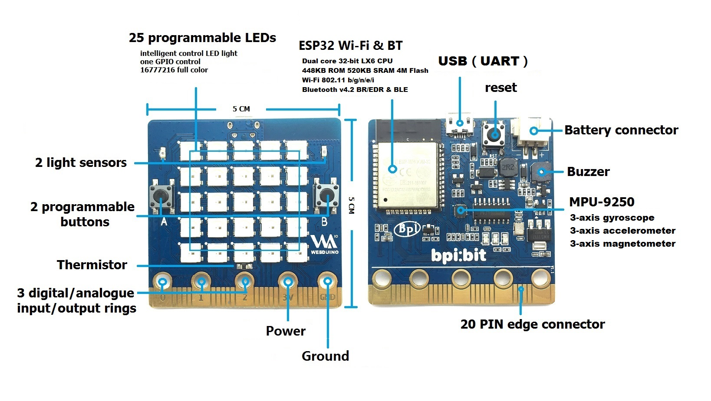
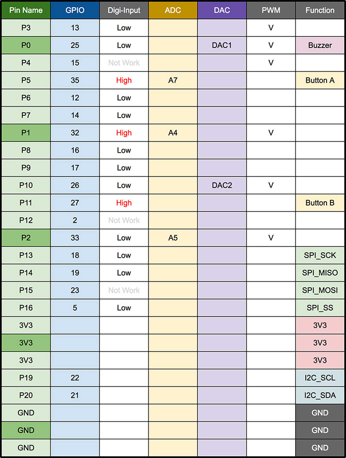
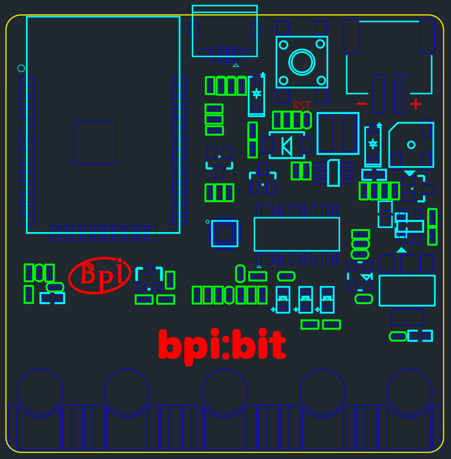

# &emsp;&emsp;&emsp;&emsp;&emsp;&emsp;&emsp;bpi:bit open source hardware

[中文文档](readme.md)

## Product introduction

This product is designed with esp-wroom-32 (ESP32) module as the core with 40 nm process, using Tensilica LX6 dual-core 32-bit processor, frequency up to 240 MHz, with 32 I/O pins, It supports 2.4g wi-fi, bluetooth 4.0 or above and other communication modes. It has a memory capacity of 448KB ROM and 520kb SRAM and a processing speed of 600 DMIPS.

## Appearance introduction

Webduino Bit development board 5 cm width 5 cm long, weighs about 10 ~ 12 grams, in addition to below 20 Pin interface "golden finger", built a 25 more full-color LED lighting matrix, two photosensitive resistance, push button switch, a temperature sensing resistor, a buzzer and a nine shaft sensor (triaxial acceleration, three-axis gyroscope and three-axis magnetic compass), space configuration is as follows:

- full-color LED matrix: A10 (GPIO 4)

- photosensitive sensor: upper left A0 (GPIO 36), upper right A3 (GPIO 39)

- button switch: button A P5 (GPIO 35), button B P11 (GPIO 27)

- temperature sensor: A6 (GPIO 34)

- buzzer: P0 (GPIO 25)

- 9 axis sensor mpu-9250: P20 (GPIO 21), P19 (GPIO 22)

## Expand the pin

### LED number

The front of the board with 25 (no. 0 ~ 24) 16 million color full-color LED (WS2812) according to the 5 * 5 arrangement. Only one pin (GPIO 4) can be used to control all LED.

LED serial Numbers of the front panel are arranged as follows (5 * 5).

| ↖  |  ↑  |  ↑  |  ↑  |  ↗ |
|-----|-----|-----|-----|-----|
| 20  | 15  | 10  | 5   | 0   |
| 21  | 16  | 11  | 6   | 1   |
| 22  | 17  | 12  | 7   | 2   |
| 23  | 18  | 13  | 8   | 3   |
| 24  | 19  | 14  | 9   | 4   |
| ↙  |  ↓  |  ↓  |  ↓  |  ↘ |
| P0  | P1  | P2  | 3V   | GND   |

(turn the board face to face and use the golden fingers on the chassis to figure out its position)

## version differs

The board is divided into 1.2 and 1.4 versions, and the version number is marked in the lower right corner on the back of the board.

## Product support

### [install driver](driver_en.md)

### Webduino

- [Webduino Basic](https://webduino.com.cn/site/zh_cn/tutorials.html)
- [Webduino player's guide](https://github.com/BPI-STEAM/BPI-BIT-WebDuino)
- [Webduino Community](http://forum.banana-pi.org/c/bpi-bit/BPI-Webduino)

### MicroPython

- [MicroPython Player's guide](https://github.com/BPI-STEAM/BPI-BIT-MicroPython)
- [MicroPython Samples](https://github.com/BPI-STEAM/MicroPython-Samples)
- [MicroPython Community](http://forum.banana-pi.org/c/bpi-bit/micropython)

### Arduino

- [Arduino player's guide](https://github.com/BPI-STEAM/BPI-BIT-Arduino)

## Hardware design

### Pin occupancy

| Interface          | IO      | Mode                                |
|--------------------|---------|-------------------------------------|
| Light Sensor(L)    | GPIO 36 | Analog Input                        |
| Light Sensor(R)    | GPIO 39 | Analog Input                        |
| Temperature Sensor | GPIO 34 | Analog Input                        |
| Buzzer             | GPIO 25 | PWM(Digital Output) / Analog Output |
| RGB_LED            | GPIO 4  | Digital Output                      |
| MPU9250_SCL        | GPIO 22 | Digital Output                      |
| MPU9250_SDA        | GPIO 21 | Digital Output                      |
| MPU9250_INT        | GPIO 16 | Digital Input                       |
| R_LED(SPI_SCK)     | GPIO 18 | Digital Output                      |

### Appearance

### Hardware Docs

- [BPI-WEBDUINO-BIT-V1_2](docs/BPI-WEBDUINO-BIT-V1_2.pdf)

- [BPI-WEBDUINO-BIT-V1_4](docs/BPI-WEBDUINO-BIT-V1_4.pdf)

- [Buzzer-SS-S050020Z-120](docs/Buzzer-SS-S050020Z-120.pdf)

- [CH340DS1-ch](docs/CH340DS1-ch.pdf)

- [CH340DS1-en](docs/CH340DS1-en.pdf)

- [esp32_hardware_design_guidelines_en](docs/esp32_hardware_design_guidelines_en.pdf)

- [ESP32-datesheet_english](docs/ESP32-datesheet_english.pdf)

- [esp-wroom-32_datasheet_cn](docs/esp-wroom-32_datasheet_cn.pdf)

- [LightSensor-PTSMD021-0805](docs/LightSensor-PTSMD021-0805.pdf)

- [LM1117](docs/LM1117.pdf)

- [MPU-9250 Datasheet-v1.1-ch](docs/MPU-9250%20Datasheet-v1.1-ch.pdf)

- [MPU-9250 Datasheet-v1.1-en](docs/MPU-9250%20Datasheet-v1.1-en.pdf)

- [MPU-9250 Register Map-v1.6](docs/MPU-9250%20Register%20Map-v1.6.pdf)

- [NTC-0805-103F-3950F](docs/NTC-0805-103F-3950F.pdf)
- [SY7208](docs/SY7208.pdf)
- [WS2812B](docs/WS2812B.pdf)
- [DS-000189-ICM-20948-v1.3](docs/DS-000189-ICM-20948-v1.3.pdf)

## Related websites

- [official Chinese community](https://forum.banana-pi.org.cn/c/bpi)

- [official English community](http://forum.banana-pi.org/c/bpi-bit)

- [Webduino domestic version](https://webduino.com.cn/site/)

- [webduino international edition](https://webduino.io/)

